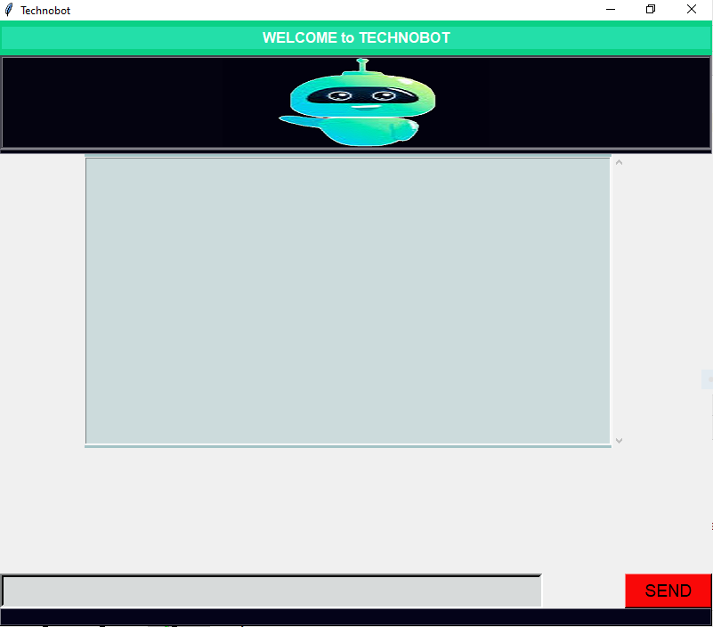

# Mini_Project_Chatbot
Official Repository for our Mini Project


### TECHNOBOT : Conversational chatbot built in Python 

Building a intelligent-chatbot can sound daunting, but it’s totally doable. TECHNOBOT is the ML  powered conversational
dialog interface project built in Python. With this tool, it’s easy to create Natural Language conversational scenarios with some
awesome python builtin libraries  and coding efforts.
The smooth UI makes it effortless to create and train conversations to the bot and it continuously gets smarter as it learns from
conversations it has with people.


## Installation
   

### Using chatterbot (Recommended) 
```sh
pip install chatterbot
pip install chatterbot-corpus
```

### Using nltk
```sh
pip install nltk
```
### Using tkinter

* import tk

* Setup Virtualenv and install python3.7 requirements
```sh
make setup

make TechnoBot 
    > img 
    > src

make README.md

```

   
  
## Contributors

 - [Rakesh Yadav](https://github.com/gfobiyatechnical)

 - [Manish Sharma](https://github.com/manish2407)
 
 - [Shivam Yadav](https://github.com/shivamyadav37)
 
    
 

## Mentor 


- [Project Report](https://docs.google.com/document/d/1bezWL9Bu9HM6mWgaExi8OICC8Jc0KeWVLQXjx2jIPd0/edit?ts=5fbfa178#)
<hr><hr>
<table>
<h3><u>Screenshots</u></h3>
<tr>
<td></td>
<td></td>
</tr>
<tr>
<td></td>
<td></td>
</tr>
</table>