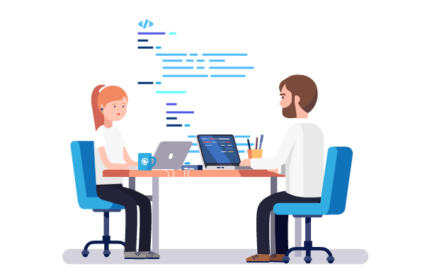
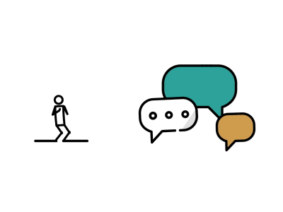

# Mini_Project_Chatbot
Official Repository for our Mini Project


### TECHNOBOT : Conversational chatbot built in Python 

Building a intelligent-chatbot can sound daunting, but it’s totally doable. TECHNOBOT is the ML  and AI powered conversational
 dialog interface project built in Python. With this tool, it’s easy to create Natural Language conversational scenarios with some
  awesome python builtin libraries  and coding efforts.
The smooth UI makes it effortless to create and train conversations to the bot and it continuously gets smarter as it learns from
 conversations it has with people.

You don’t need to be an expert at artificial intelligence and machine learning to create an awesome chatbot that has AI capabilities but you must be familiar with some cool python's libraries.
With this mini-project you can create an AI and ML powered chatting application for real-time conversation.

## Installation
   

### Using chatterbot (Recommended) 
```sh
pip install chatterbot
pip install chatterbot-corpus
```

### Using nltk
```sh
pip install nltk
```
### Using tkinter

* import tk

* Setup Virtualenv and install python3.7 requirements
```sh
make setup

make TechnoBot 
    > img 
    > src

make README.md

```

   
  
## Contributors

 - [Rakesh Yadav](https://github.com/gfobiyatechnical)

 - [Manish Sharma](https://github.com/manish2407)
 
 - [Shivam Yadav](https://github.com/shivamyadav37)
 
    
 
 


## Mentor 
[Mr. Pankaj Sharma]( )


   
